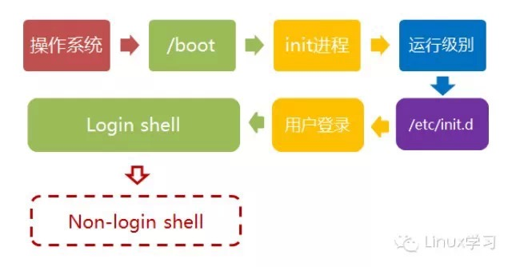

按下电源按钮的直到欢迎页出来之后，linux总共做的事可以分为五步来完成。

<!--more-->

**1、 BIOS加电自检：**

加电自检，检测硬件设备。然后按照cmos上面的顺序来搜索处在活动状态下的可以引导的设备。可以是光驱、软盘、USB等。

**2、 加载主引导加载程序（MBR）：**

主引导程序是一个512字节的映像。包含一点机器码还有一个小的分区。

主引导程序的任务就是查找并且加载处在硬盘分区上的次引导程序。通过分区表查找活动分区，并将处在活动分区的**次引导加载程序读取到内存里面运行**。

**3、 加载次引导记载程序（GRUB）**

次引导加载程序只要就是加载linux内核。

上一阶段结束之后**次引导加载程序就会在内存里面跑起来**。就会出现GRUB图形界面，让用户选择加载什么样的内核。

**4、 linux内核映像：**

用户选择要加载的内核之后，次引导加载程序（GRUB）就会根据/boot/grub.conf配置文件中所设置的信息，从/boot/所在的分区上读取Linux内核映像，然后**把内核映像加载到内存中**并把控制权交给Linux内核。

linux内核获得控制权之后开始干自己的事

<ul class=" list-paddingleft-2">
  <li>
    检测硬件
  </li>
  <li>
    解压缩自己并安装必要驱动
  </li>
  <li>
    初始化与文件系统相关的虚拟设备，LVM或RAID
  </li>
  <li>
    装载根文件系统，挂在根目录下面
  </li>
  <li>
    完成之后，linux在进程空间里面加载init程序，下面轮到init干活
  </li>
  <li>
    init进程
  </li>
</ul>

init是所有进程的发起者和控制者，所有的进程都由此衍生。

init进程获得控制权之后，它会执行/etc/rc.d/rc.sysinit脚本，根据里面的代码设置环境变量、网络、启动swap、检查并挂载文件系统、执行其他初始化工作。

至此，linux启动完成。

我们稍微总结一下：

首先是BIOS加电自检，之后加载主引导加载程序、次引导加载程序，最后就是linux内核映像，完了把控制权交给init进程，完成初始化工作。

swap分区是什么？

类似windows系统中的虚拟内存，当物理内存不够用的时候，使用swap中的内存。

转自：<a href="http://mp.weixin.qq.com/s?__biz=MzA3MDc1MzQ2NA==&mid=204516686&idx=1&sn=8f4e12823345d70076e9c0e460ab6d06&scene=5&srcid=1012txW9hXlV5j7NzdYitTqL#rd" target="_blank">Linux学习</a>