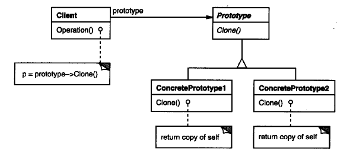

原型模式属于创建型模式，《设计模式》一书对中原型模式的描述为：

> 用原型实例指定创建对象的种类，并且通过拷贝这些原型创建新的对象。

<!--more-->

原型模式的关键点在于原型实例与实例的复制，而实例的克隆分为深复制与浅复制。深复制与浅复制的不同点在于，浅复制对于字段是值类型的，则对该字段执行逐位复制，如果字段是引用类型，则复制引用但不复制引用的对象；因此，原始对象与其副本引用同一对象。**浅复制的结果是副本所有变量都包含与原来对象相同的值，而所有的对其他对象的引用都仍指向原来的对象。深复制把引用对象的变量指向复制过的新对象，而不是原有的被引用的对象。**

在使用深复制时，我们需要把握好复制的深度，并且要当心出现循环引用的问题。

#### 1.模式适用性

  * 当实例化的类实在运行时刻指定时
  * 当使用一个原型可以简化一批对象的创建过程时

#### 2.模式结构

#### 3.实现

<pre class="brush: cpp; title: ; notranslate" title="">#include <stdio.h>
#include <string.h>
#include <iostream>

using namespace std;

class Human
{
public:
	int sex;
	int age;
	virtual Human* clone() = 0;
	Human(){};
	virtual ~Human(){};
};

class Female : public Human
{
public:
	Female(){sex = 0;};
	~Female(){};
	Female* clone()
	{
		Female *ptr = new Female();
		memcpy(ptr, this, sizeof(Female));
		return ptr;
	};
};

class Male : public Human
{
public:
	Male(){sex = 1;};
	~Male(){};
	Male* clone()
	{
		Male *ptr = new Male();
		memcpy(ptr, this, sizeof(Male));
		return ptr;
	};
};

int main()
{
	Female *mm = new Female();
	cout << "mm's sex number is:"<< mm->sex << endl;
	Female *mm1 = mm->clone();
	cout << "mm1's sex number is:"<< mm1->sex << endl;

	Male *gg = new Male();
	gg->age = 18;
	cout << "gg's sex number is:"<< gg->sex << "\tage is:" << gg->age << endl;
	Male *gg1 = gg->clone();
	cout << "gg1's sex number is:"<< gg1->sex << "\tage is:" << gg1->age << endl;
	
}
</pre>