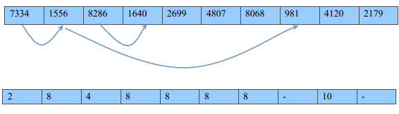
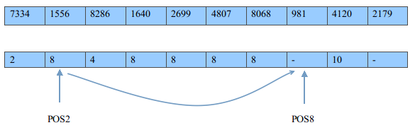

算法原题来自：<a href="http://hihocoder.com/problemset/problem/1068" target="_blank">hihocoder</a>

你可以在我的github获取源码：<a href="https://github.com/Wtango/hihocoder/blob/master/code1068.c" target="_blank">github</a>

这次题目是比较常见的在已知的数据中，对于给定的范围区间查找最小值。对于这类题目，我的想法是，求出每一个位置上的数的后方，最先出现比其小的数，记录下这个位置，这样在我们对给出区间求最小值的时候则可利用这个位置的记录减少大量的比较。

<!--more-->

#### 生成位置表

下面展示我们如何求出这个“下一个比当前位置值小的位置”

图中使用‘-’符号表示这个位置之后都没有 这个位置的值小的位置，在程序中我们可以使用0来表示这个含义。

#### 使用位置表

如例子中，我们将要寻找[2,8]区间的最小值。 

我们在位置表中查找位置，其下一个小于位置2的位置为位置8,位置8没有超过查找区间，则查找区间中最小值跳去8位置，查看位置8,其符号是‘-’，表示当前已经直到末尾为最大，所以取元数组中位置8的值，则是‘981’。

<pre class="brush: cpp; title: ; notranslate" title="">#include <stdio.h>
int N;
int Q;
int Li,Ri;
int weight[1000010];
int lightnode[1000010] = {0};
int main()
{
	scanf("%d",&N);
	int i,j;
	for(i = 1; i <= N; i++) {
		scanf("%d",weight + i);
	}
	for(i = 1; i < N; i++) {
		for(j = i + 1; j < N; j++) { if(weight[i] > weight[j]) {
				lightnode[i] = j;
				break;
			}
		}
	}
	scanf("%d",&Q);
	for(i = 0; i < Q; i++) {
		scanf("%d%d",&Li,&Ri);
		int pos = Li;
		while((lightnode[pos] <= Ri) && (lightnode[pos] != 0))
			pos = lightnode[pos];
		printf("%d\n",weight[pos]);
	}
}
</pre>