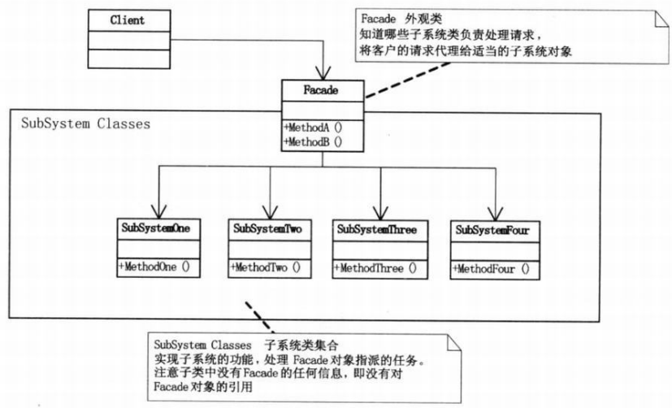

为子系统中的一组接口提供一个一致的界面, Facade模式定义了一个高层接口,这个接口使得这一子系统更加容易使用。将一个系统划分成为若干个子系统有利于降低系统的复杂性。一个常见的设计目标是使子系统间的通信和相互依赖关系达到最小,它为子系统中较一般的设施提供了一个单一而简单的界面。

<!--more-->

#### 1.模式适用性

  * 当需要为一个复杂子系统提供一个简单的接口时
  * 当需要减小子系统间的相互依赖时，可使用facade模式简化依赖关系
  * 维护遗留系统难以扩展时，使用facade模式简化遗留系统的使用

#### 2.模式结构

**(1)Facade:**作为子系统的统一接口，知道哪些子系统负责处理请求，并将客户的请求代理给适当的子系统对象处理

**(2)Subystem classes(SubSystemOne,SunSystemTwo等)：**实现子系统的功能，处理由Facade指派的任务

#### 3.实现

&nbsp;

<pre class="brush: cpp; title: ; notranslate" title="">#include <iostream>
using namespace std;

class SubSystemOne
{
public:
	void MethodOne()
	{
		cout << "Sub one function" << endl;
	}
};

class SubSystemTwo
{
public:
	void MethodTwo()
	{
		cout << "Sub two function" << endl;
	}
};

class SubSystemThree
{
public:
	void MethodThree()
	{
		cout << "Sub three function" << endl;
	}
};

class SubSystemFour
{
public:
	void MethodFour()
	{
		cout << "Sub four function" << endl;
	}
};

class Facade
{
private:
	SubSystemOne *one;
	SubSystemTwo *two;
	SubSystemThree *three;
	SubSystemFour *four;
public:
	Facade()
	{
		one = new SubSystemOne();
		two = new SubSystemTwo();
		three = new SubSystemThree();
		four = new SubSystemFour();
	}

	void MethodA()
	{
		cout << "***Function group A***" << endl;
		one->MethodOne();
		two->MethodTwo();
		three->MethodThree();
	}

	void MethodB()
	{
		cout << "***Function group B***" << endl;
		four->MethodFour();
		one->MethodOne();
	}
};

int main(int argc, char *argv[])
{
	Facade facade;

	facade.MethodA();
	facade.MethodB();

	return 0;
}
</pre>