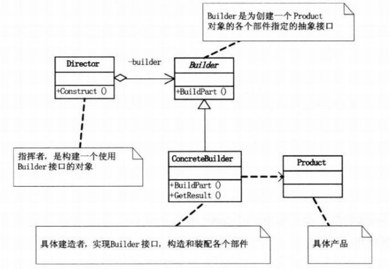

建造者模式属于创建型模式，即用以创建对象。创建者模式定义了一个Builder,这个Builder规定了创建对象的一系列必须实现的动作，所以实现这个Builder的子类必须实现这一系列的动作，那么就不会因为少了哪个动作而导致创建对象出问题，应为少了某个动作编译器也不会让代码通过。看一下《设计模式》是如何定义建造者模式的：

<!--more-->

> 将一个复杂对象的构建与它的表示分离,使得同样的构建过程可以创建不同的表示。

#### 1. 模式适用性

  * 当创建复杂对象的算法应该独立于该对象的组成部分以及它们的装配方式时
  * 当构造过程必须允许被构造的对象有不同的表示时

#### 2. 模式结构

**(1) Builder:**为创建一个Product对象的各个部件指定抽象接口。

**(2)ConcreteBuilder:**实现了Builder的接口以构造和装配该产品的各个部件

**(3)Product:**待创建的对象类

**(4)Director:**使用Builder的接口，并且可以在其内部对产品创建的过程顺序进行安排

#### 3. 实现

<pre class="brush: cpp; title: ; notranslate" title="">#include &lt;iostream&gt;
#include &lt;vector&gt;
#include &lt;string&gt;
 
using namespace std;
//Product类
class Product
{
    vector&lt;string&gt; parts;
public:
    void Add(const string part)
    {
        parts.push_back(part);
    }
    void Show()const
    {
        for(int i = 0 ; i &lt; parts.size() ; i++)
        {
            cout&lt;&lt;parts[i]&lt;&lt;endl;
        }
    }
};
//抽象builder类
class Builder
{
public:
    virtual void BuildHead() = 0;
    virtual void BuildBody() = 0;
    virtual void BuildHand() = 0;
    virtual void BuildFeet() = 0;
    virtual Product GetResult() = 0; 
};
//具体胖人创建类
class FatPersonBuilder :public Builder
{
private:
    Product product;
public:
    virtual void BuildHead()
    {
        product.Add("胖人头");//创建胖人的头
    }
    virtual void BuildBody()
    {
        product.Add("胖人身体");//创建胖人的身体
    }
    virtual void BuildHand()
    {
        product.Add("胖人手");//创建胖人的手
    }
    virtual void BuildFeet()
    {
        product.Add("胖人脚");//创建胖人的脚
    }
    virtual Product GetResult()
    {
        return product;
    }
};
//具体瘦人人创建类
class ThinPersonBuilder :public Builder
{
private:
    Product product;
public:
    virtual void BuildHead()
    {
        product.Add("瘦人人头");//创建瘦人的头
    }
    virtual void BuildBody()
    {
        product.Add("瘦人身体");//创建瘦人的身体
    }
    virtual void BuildHand()
    {
        product.Add("瘦人手");//创建瘦人的手
    }
    virtual void BuildFeet()
    {
        product.Add("瘦人脚");//创建瘦人的脚
    }
    virtual Product GetResult()
    {
        return product;
    }
};
//Director类
class Director
{
public:
    void Construct(Builder &builder)
    {
        builder.BuildHead();
        builder.BuildBody();
        builder.BuildHand();
        builder.BuildFeet();
    }
};

int main()
{
    Director *director = new Director();
    Builder *b1 = new FatPersonBuilder();
    Builder *b2 = new ThinPersonBuilder();

    director-&gt;Construct(*b1);
    Product p1 = b1-&gt;GetResult();
    p1.Show(); 
    return 0;
}
</pre>