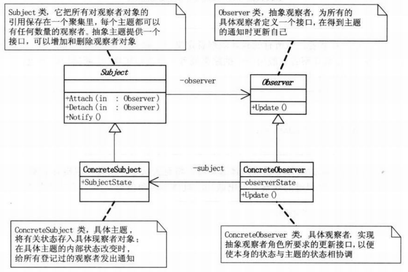

观察者模式也称为发布-订阅模式，属于行为模式。观察者模式定义了一种一对多的依赖关系，多个观察者可以订阅同一个主题，在主题发生变化的时候，所有观察者都接收到更新通知，以更新自己的状态。观察者模式在维护系统相关对象一致性的时候，可以降低各个类之间的耦合，使主题与观察者可以独立开来。
  
<!--more-->

#### 1. 模式适用性

  * 当一个对象的改变需要给变其它对象时，而且它不知道具体有多少个对象有待改变时。
  * 一个抽象某型有两个方面，当其中一个方面依赖于另一个方面，这时用观察者模式可以将这两者封装在独立的对象中使它们各自独立地改变和复用。

#### 2. 模式结构

**(1)Subject类**：抽象主题，将保存所有观察者的引用，并且提供接口以添加和删除观察者。

**(2)Observer类**：抽象观察者，定义了所有观察者必须实现的更新自己的接口&#8211;Update。

**(3)ConcreteSubject类**：具体主题，保存主题属性，在主题属性发生变化的时候，给所有登记过的观察者发出通知。

**(4)ConcreteObserver类**：具体观察者，实现抽象观察者所要求的接口，以便使本身的状态与主题状态协调(相关对象一致性)。具体观察者直接订阅具体主题，即可保存一个指向具体主题对象的引用。

#### 3. 实现

&nbsp;

<pre class="brush: cpp; title: ; notranslate" title="">#include <iostream>
#include <list>
using namespace std;

class Observer
{
public:
	Observer() {};
	virtual ~Observer() {};
	virtual void Update() = 0;
};

class Subject
{
private:
	list<Observer*> _observers;
public:
	Subject() {};
	virtual ~Subject() {};

	void Attach(Observer *observer)
	{
		_observers.push_back(observer);
	}

	void Detach(Observer *observer)
	{
		_observers.remove(observer);
	}

	void Notify()
	{
		for(list<Observer*>::iterator it = _observers.begin();
			 it != _observers.end(); ++ it) {
			(*it)->Update();
		}
	}
};

class ConcreteSubject : public Subject
{
public:
	char key;
};

class ConcreteObserver1 : public Observer
{
private:
	ConcreteSubject *subject;
public:
	ConcreteObserver1(ConcreteSubject *subj){subject = subj;};
	void Update()
	{
		cout << "Observer1 recive notify,key is " << subject->key << endl;
	}
};

class ConcreteObserver2 : public Observer
{
private:
	ConcreteSubject *subject;
public:
	ConcreteObserver2(ConcreteSubject *subj){subject = subj;};
	void Update()
	{
		cout << "Observer2 recive notify,key is " << subject->key << endl;
	}
};

int main(int argc, char *argv[])
{
	ConcreteSubject *subject = new ConcreteSubject();

	ConcreteObserver1 observer1(subject);
	ConcreteObserver2 observer2(subject);

	subject->Attach(&observer1);
	subject->Attach(&observer2);

	subject->key = 'W';
	subject->Notify();

	subject->key = 'T';
	subject->Notify();

	delete subject;
	return 0;
}
</pre>

#### 4. 总结

**优点**
  
　　观察者模式解除了主题和具体观察者的耦合，让耦合的双方都依赖于抽象，而不是依赖具体。从而使得各自的变化都不会影响另一边的变化。

**缺点**
     
依赖关系并未完全解除，抽象通知者依旧依赖抽象的观察者。