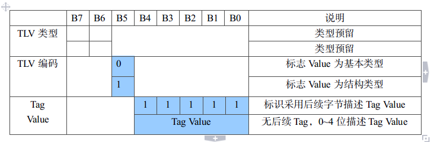
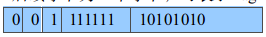
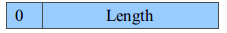
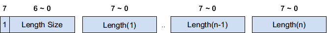
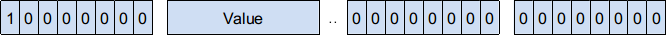
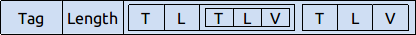
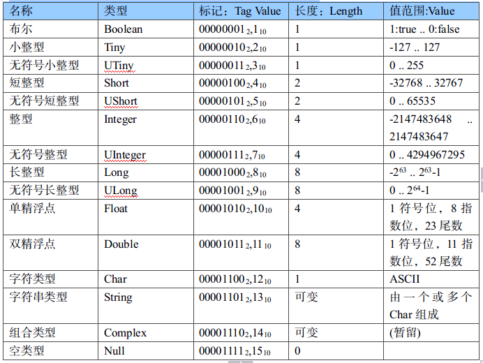
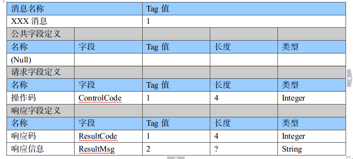
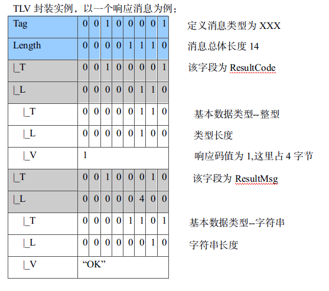

#### 1. 通信协议

通信协议（communications protocol）是指双方实体完成通信或服务所必须遵循的规则和约定。通过通信信道和设备互连起来的多个不同地理位置的数据通信系统，要使其能协同工作实现信息交换和资源共享，它们之间必须具有共同的语言。交流什么、怎样交流及何时交流，都必须遵循某种互相都能接受的规则。这个规则就是通信协议。

本文描述了一种 Type-length-value 结构的数据编码格式，简称为TLV编码。对于TCP/IP模型来说，TLV属于应用层协议。TLV编码可以自我嵌套，即一个TLV的value部分可以包含一个或多个TLV，这样的结构使得TLV编码十分容易扩展。

我编写了一个C++的实现放于Github上：<a href="https://github.com/Wtango/tlv" target="_blank">https://github.com/Wtango/tlv</a>
  
<!--more-->

#### 2. TLV编码

TLV是指由数据的类型Tag，数据的长度Length，数据的值Value组成的结构体，几乎可以描任意数据类型，TLV的Value也可以是一个TLV结构，正因为这种嵌套的特性，可以让我们用来包装协议的实现。一个TLV编码的数据帧格式如下：

下面将分别描述Tag、Length与Value的定义。

##### 2.1. Tag

Tag 描述了Value的数据类型,Tag可由一个或两个字节组成,Tag长度组成由Tag自身描述。Tag首字节如下表所示:

###### 1) Tag首节字说明

  * 预留。
  * 第5位表示Value的编码方式，分别支持Primitive及Constructed两种编码方式, Primitive(0)指以原始数据类型进行编码，Constructed(1)指以TLV方式进行编码。
  * 当Tag Value小于0x1F(31)时，首字节0～4位用来描述Tag Value，否则0~4位全部置1，作为存在后续字节的标志，Tag Value将采用后续字节进行描述。

###### 2) Tag后续字节说明

后续字节为一个字节，可表示Tag Value范围为0~255，下面表示一个由两个字节组成的Tag

表示Tag Value为0XAA。

##### 2.2. Length

描述Value部分所占字节的个数，编码格式分两类：定长方式（DefiniteForm）和不定长方式（IndefiniteForm），其中定长方式又包括短形式与长形式。

###### 1) 定长方式

定长方式中，按长度是否超过一个八位，又分为短、长两种形式，编码方式如下：

  * 短形式： 字节第7位为0，表示Length使用1个字节即可满足Value类型长度的描述，范围在0~127之间的。

  * 长形式： 即Value类型的长度大于127时，Length需要多个字节来描述，这时第一个字节的第7位置为1，0~6位用来描述Length值占用的字节数，然后直将Length值转为byte后附在其后，Length Size的值不超过4,即后续长度不应超过4字节。如： Value大小占234个字节（11101010）,由于大于127，这时Length需要使用两个字节来描述，10000001 11101010

###### 2) 不定长方式

Length所在八位组固定编码为0x80，但在Value编码结束后以两个0x00结尾。这种方式使得可以在编码没有完全结束的情况下，可以先发送部分数据给对方。

##### 2.3 Value

由一个或多个值组成 ，值可以是一个原始数据类型(Primitive Data)，也可以是一个TLV结构(Constructed Data)；Value的编码方式由Tag首字节的第5位决定。

###### 2.3.1 Primitive Data编码

###### 2.3.2 Constructed Data编码

#### 3.TLV应用

应用部分举了一个例子说明TLV在使用网络编程中的应用，如何使用TLV表示一个消息。

##### 3.1 基本数据类型约定

在应用中可能需要使用到基本数据类型，所以需要约定基本数据类型的表示。在一个TLV数据报中，如果Tag首字节的第5个位为0,则其Value部分为基本数据类型编码方式。下表约定了基本数据类型与Tag Value的对应关系：

##### 3.2 消息定义

定义一个XXX消息

构造好这个TLV之后可以使用TLV编码器将其转化为一个字节流，其后可通过各式网络进行发送。而客户端可使用收到的字节流解码获得这个TLV。

#### 4.总结

本文描述了TLV编码的结构，并且给出了一个C++的实现(<a href="https://github.com/Wtango/tlv" target="_blank">Github</a>)，对于需要灵活的通讯消息并且要较少的通讯带宽的应用来说，使用这个编码十分合适，其是字节编码协议，相对于字符编码(json、xml等)有较大的优势。

实现中有一个需要注意的地方，Server与Client大小端不一致的情况下，需要小心基本数据类型value的表示方式。