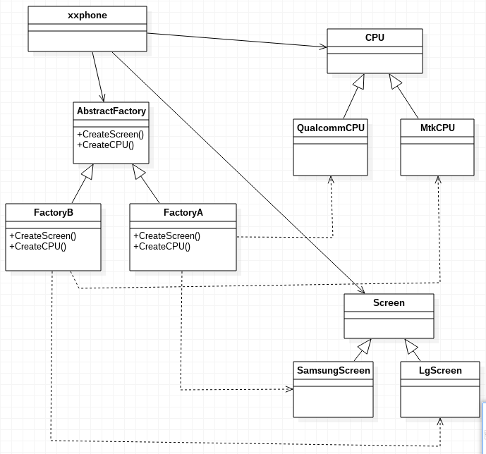

- [1.模式适用性](#1模式适用性)
- [2.模式结构](#2模式结构)
- [3.实现](#3实现)
- [4.总结](#4总结)

我们之前说道工厂方法模式，工厂方法模式只只定义了一个类型的产品，并且工厂也是只提供了一个类型产品的生产。在抽象工厂模式中，我们的工厂丰富了产品线，不仅仅只能生产一种产品，而是多种产品，并且可以通过扩展产品线或更改产品的组合构成一个符合使用的产品。设计模式中如此描述抽象工厂模式:

> 提供一个创建一系列相关或相互依赖对象的接口,而无需指定它们具体的类。

这个可以比较抽象不好理解，我们举一个制造手机的例子类解释抽象工厂模式的结构和使用。

## 1.模式适用性

  * 一个系统要独立于它的产品的创建、组合和表示时
  * 一个系统要由多个产品系列中的一个来配置时
  * 当你要强调一系列相关的产品对象的设计以便进行联合使用时
  * 当你提供一个产品类库,而只想显示它们的接口而不是实现时

## 2.模式结构

现有一手机厂商，可能生产多款手机，CPU可能选择联发科的或者高通的，屏幕可能选择LG的或者三星的。那么手机厂商则需要找不同的工厂来生产需要的部件。



**(1）AbstractFactory**：定义了创建产品的接口

**(2）CPU与Screen**：两个都是xxphone厂商需要的产品，而其继承类则是具体的产品，今后可以添加海思麒麟或者Sharp的屏幕（新的产品实现）

**(3）FactoryA与FactoryB**：是具体的工厂，这些工厂实现了具体生产什么产品，是一个什么样的组合。xxPhone还可能选择有其他生产能力的工厂（创建心的工厂）

## 3.实现

```c++
#include <iostream>
#include <string>
using namespace std;

class CPU
{
public:
	CPU(const char *str):brand(str){}
	const char *brand;
};

class QualcommCPU : public CPU
{
public:
	QualcommCPU():CPU("Qualcomm") {};
};

class MtkCPU : public CPU
{
public:
	MtkCPU():CPU("MTK") {};
};

class Screen
{
public:
	Screen(const char *str):brand(str) {};
	const char *brand;
};

class SamsungScreen : public Screen
{
public:
	SamsungScreen():Screen("Samsung"){};
};

class LgScreen : public Screen
{
public:
	LgScreen():Screen("LG"){};
};

class AbstractFactory
{
public:
	virtual Screen* CreateScreen() {};
	virtual CPU* CreateCPU() {};
};

class FactoryA : public AbstractFactory
{
public:
	Screen* CreateScreen() {return new SamsungScreen();}
	CPU* CreateCPU() {return new QualcommCPU();}
};

class FactoryB : public AbstractFactory
{
public:
	Screen* CreateScreen() {return new LgScreen();}
	CPU* CreateCPU() {return new MtkCPU();}
};

void showInfo(CPU *cpu, Screen *screen)
{
	cout << "xxPhone get some " << screen->brand << " screens and some " <<
	cpu->brand << "CPUs." << endl;
}

int main(int argc, char *argv[])
{
	CPU *cpu;
	Screen *screen;
	AbstractFactory *factory;

	cout << "xxPhone build a new product,they ask FactoryA for suppling" << endl;
	factory = new FactoryA();
	screen = factory->CreateScreen();
	cpu = factory->CreateCPU();
	showInfo(cpu, screen);

	cout << "xxPhone build another product,they ask FactoryB for suppling" << endl;
	factory = new FactoryB();
	screen = factory->CreateScreen();
	cpu = factory->CreateCPU();
	showInfo(cpu, screen);

	return 0;
}
```

## 4.总结

抽象工厂模式不仅仅是工厂方法模式的更高层次的抽象，其所解决的问题是一系列相关的产品的创建与组合。但在使用设计模式的过程中，不可为了抽象而抽象，我们的设计应面向应用，过度的抽象会导致系统更加复杂，我们应谨慎评估一个设计模式是否应该实在具体设计中。