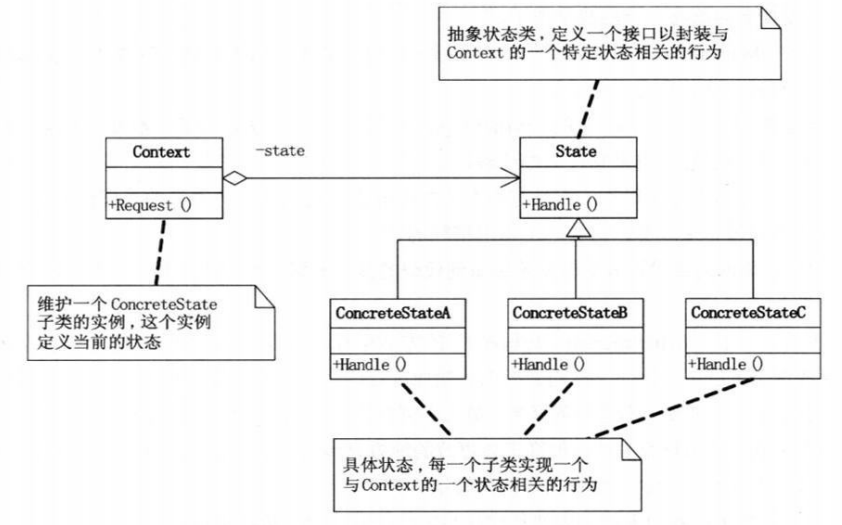

状态模式主要解决的是当控制一个对象状态转移的条件表达式过于复杂的情况。把状态逻辑转移到表示不同状态的一系列类当中，可以把复杂的判断逻辑简化。解决状态机相关的问题非常适合使用状态模式，当状态较多的情况下，我们需要修改状态机则只需要修改状态迁移前后相关的类，而不是到一连串的case语句下修改。
  
<!--more-->

  
DP对状态模式的概括：

> 当一个对象的内在状态改变时允许改变其行为，这个对象看起来像是改变了其类。

#### 1.模式适用性

  * 当一个对象的行为取决于它的状态，并且它必须在运行时刻根据状态改变它的行为时，就可以考虑使用状态模式来。
  * 一个操作中含有庞大的分支结构，并且这些分支决定于对象的状态。

#### 2.模式结构

**(1)Context:**定了状态存在的上下文，并且维护了一个ConcreteState子类的实例,这个实例定义当前状态,Context是用户的主要接口，用户可以配置一个初始状态，一旦经过配置用户不再需要直接与状态对象打交道。

**(2)State:**定义一个接口以封装与 Context的一个特定状态相关的行为。

**(3)ConcreteState:**具体的状态子类，每一个子类实现一个与Context状态相关的行为。

#### 3.实现

下面举一个简单的例子，一个灯有两个状态：开与关。在每操作一次灯的状态就转化到另一状态(toggle)。

&nbsp;

<pre class="brush: cpp; title: ; notranslate" title="">#include &lt;iostream&gt;
using namespace std;

class Light;
class LightState
{
public:
	virtual void Switch(Light *) = 0;
};

class Light
{
public:
	LightState *state;
	Light(LightState *initState);
	void Press();
};

class On : public LightState
{
public:
	void Switch(Light *light);
};

class Off : public LightState
{
public:
	void Switch(Light *light);
};

On lightOn;
Off lightOff;

void On::Switch(Light *light)
{
	cout &lt;&lt; "Trun off the light." &lt;&lt; endl;
	light-&gt;state = &lightOff;
}

void Off::Switch(Light *light)
{
	cout &lt;&lt; "Trun On the light." &lt;&lt; endl;
	light-&gt;state = &lightOn;
}

Light::Light(LightState *initState)
{
	this-&gt;state = initState;
}

void Light::Press()
{
	this-&gt;state-&gt;Switch(this);
}

int main()
{
	Light *led = new Light(&lightOff);
	led-&gt;Press();
	led-&gt;Press();
	led-&gt;Press();
	led-&gt;Press();
	led-&gt;Press();
	led-&gt;Press();
	delete led;
	return 0;
}
</pre>

#### 4.总结

状态模式可以将不同的状态对应的行为分离到多个子类中，并将状态转化规则放到子类中来解决，可以方便的添加和维护状态。但正是因为这样的就够也会导致系统类的增多。对于C++中实现状态模式，需要考虑状态子类的创建与销毁问题，可以考虑将状态子类作为单例，在使用时创建直到程序结束时统一销毁。