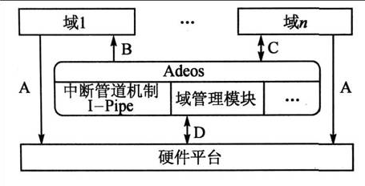

- [1. Xenomai是什么](#1-xenomai是什么)
- [2. Xenomai架构](#2-xenomai架构)
  - [2.1 双内核结构](#21-双内核结构)
  - [2.2 Adeos](#22-adeos)
    - [3. 性能测试](#3-性能测试)

## 1. Xenomai是什么

Xenomai是一个于Linux平台上使用的实时框架，其使得各种实时操作系统（vxWorks、QNX等）的API在Linux平台上可用，并且为Linux平台提供硬实时调度保障。

Xenomai不仅可以运行主线Linux内核，也可以运行于各种嵌入式平台，官方对许多嵌入式平台做了支持。我们可以从这里<a href="https://xenomai.org/embedded-hardware/" target="_blank">https://xenomai.org/embedded-hardware/</a>找到官方支持的嵌入式设备。

<!--more-->

总的来说，Xenomai可以帮助你完成以下工作：

  * 在Linux上设计、开发和运行实时应用程序
  * 将RTOS的应用程序移植到Linux
  * 以Linux原生应用程序的方式运行RTOS应用（VxWorks, pSOS, VRTX, uITRON, POSIX）

## 2. Xenomai架构

### 2.1 双内核结构

Xenomai操作双内核的结构提供实时操作。一个是高优先级的微内核co-kernel，另一个是Linux内核。co-kernel用于运行实时任务，而Linux内核则像往常一样提供Linux的各种服务，两个内核由Adeos管理着，一个内核占据一个域。

需要注意的是微内核域有可能会切换到Linux Kernel域中去，这会对Xenomai的实时性破坏。产生这种情况的原因有可能是在实时任务中使用了Linux的一些系统调用，所以在实时任务中注意Linux系统调用的使用。

### 2.2 Adeos

Adeos/i-pipe是实现双内核的关键，Xenomai和RTAI都是基于Adeos实现的。在基于Adeos 的系统中，每个操作系统都是在独立的域内运行（但不一定所有的域实现的都是操作系统，也可以是完成其它功能的软件实体），每个域可以有独立的地址空间和类似于进程、虚拟内存等的软件抽象层，而且这些资源也可以由不同的域共享。

对于一个计算机系统来说，系统的运行是由内部和外部的中断和异常所触发的，例如系统时钟中断对操作系统来说就是最重要的。所以，Adeos 的主要工作就是管理硬件的中断，根据域的优先级依次执行相应域的中断服务程序，从而驱动域内的系统运行；同时，Adeos 还提供域之间的通信机制实现域的调度等。

为了实现对中断的管理和域之间的优先级控制，Adeos 使用了中断管道(Interrupt Pipe)的概念。Adeos 通过中断管道在不同的域之间传播中断，而且提供了相应的机制可以让域改变自己在中断管道中的优先级。

Xenomai 在Adeos 系统中的域优先级高于Linux 域，每当中断到来之后，Adeos先调度Xenomai 对该中断进行处理、执行中断相应的实时任务，只有当Xenomai 没有实时任务和中断需要处理的时候，Adeos 才会调度Linux 运行，这就保证了Xenomai的中断响应速度和实时任务不受Linux 的影响，从而提供了实时系统的可确定性。

下图体现了co-kernel，Linux kernel和Adeos之间的关系

#### 3. 性能测试

Xenomai提供了一系列的性能测试工具，在安装好Xenomai之后这些工具会放置在Xenomai安装目录的bin/目录下。下面列举出了这些测试工具：

  * <a href="https://xenomai.org/documentation/xenomai-2.6/html/clocktest/index.html" target="_blank">clocktest</a>&#8211;用于测试CPU时钟
  * <a href="https://xenomai.org/documentation/xenomai-2.6/html/cyclictest/index.html" target="_blank">cyclictest</a>&#8211;用于测试Xenomai POSIX 周期定时器
  * <a href="https://xenomai.org/documentation/xenomai-2.6/html/dohell/index.html" target="_blank">dohell</a>&#8211;用于产生负载的程序
  * <a href="https://xenomai.org/documentation/xenomai-2.6/html/irqbench/index.html" target="_blank">irqbench</a>&#8211;IRQ测试
  * <a href="https://xenomai.org/documentation/xenomai-2.6/html/irqloop/index.html" target="_blank">irqloop</a>&#8211;IRQ测试
  * <a href="https://xenomai.org/documentation/xenomai-2.6/html/klatency/index.html" target="_blank">klatency</a>&#8211;内核空间时延测试工具
  * <a href="https://xenomai.org/documentation/xenomai-2.6/html/latency/index.html" target="_blank">latency</a>&#8211;定时器时延测试工具
  * <a href="https://xenomai.org/documentation/xenomai-2.6/html/switchbench/index.html" target="_blank">switchbench</a>&#8211;任务切换时延测试工具
  * <a href="https://xenomai.org/documentation/xenomai-2.6/html/switchtest/index.html" target="_blank">switchtest</a>&#8211;用于测试现成上下文的切换
  * <a href="https://xenomai.org/documentation/xenomai-2.6/html/xeno-test/index.html" target="_blank">xeno-test</a>&#8211;运行用户脚本，测试最好时延与最坏时延