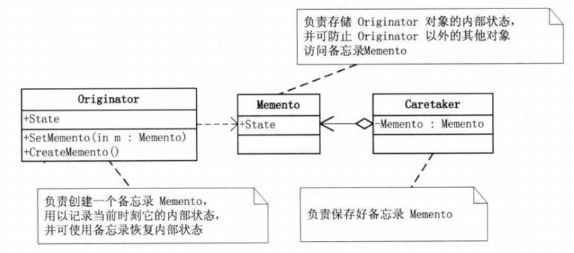

备忘录模式顾名思义就是用于保存一个类的状态的设计模式。这个 模式可用于类似“撤销”等功能的实现。设计模式中如此描述备忘录模式(Memento):

> 在不破坏封装性的前提下,捕获一个对象的内部状态,并在该对象之外保存这个状态。这样以后就可将该对象恢复到原先保存的状态。

<!--more-->

#### 1.模式适用性

  * 必须保存一个对象在某一个时刻的 (部分)状态, 这样以后需要时它才能恢复到先前的状态。
  * 如果一个用接口来让其它对象直接得到这些状态,将会暴露对象的实现细节并破坏对象的封装性。

#### 2.模式结构

**(1)Originator:**发起人，负责创建一个备忘录Memento，用以记录当前时刻它的内部状态，并可以使用备忘录恢复内部状态。

**(2)Memento:**备忘录，负责保存Originator对象的内部状态，并防止Originator以外的其他对象访问备忘录Memento。

**(3)Caretaker:**管理者，负责保存好备忘录，不对备忘录的内容进行操作或者检查。

#### 3.实现

&nbsp;

<pre class="brush: cpp; title: ; notranslate" title="">#include &lt;iostream&gt;
#include &lt;string&gt;
using namespace std;
class Memento
{
public:
	Memento(string state):_state(state){};
	string _state;
};

class Originator
{
public:
	Memento* createBackups()
	{
		return new Memento(_state);
	}
	void restoreBackups(Memento* memento)
	{
		_state = memento-&gt;_state;
	}
	void show()
	{
		cout&lt;&lt;_state&lt;&lt;endl;
	}
	string _state;
};

class Caretaker
{
public:
	~Caretaker()
	{
		delete _memento;
	}
	Memento* getMemento()
	{
		return _memento;
	}
	void setMemento(Memento* memento)
	{
		_memento = memento;
	}
	Memento *_memento;
};

int main(void)
{
	Originator o;
	o._state = "original test";
	o.show();

	Memento* m = o.createBackups();
	Caretaker c;
	c.setMemento(m);

	o._state = "some test error will be reboke later";
	o.show();

	m = c.getMemento();
	o.restoreBackups(m);

	o.show();
	return 0;
}
</pre>

#### 4.总结

备忘录模式比较适用于功能复杂的，但需要维护或者记录属性历史的类，或者需要保存的属性只是众多属性中的一小部分时，Originator可以根据保存的Menento信息还原到前一状态。

在实际使用备忘录时，Caretaker管理者可以考虑使用栈或者Map等数据结构对备忘录进行保存，根据实际使用情况选定。

备忘录也有缺点，备忘录本身的空间资源消耗，数据恢复的有效性也不是此设计模式中考虑的问题，所以需要进行额外的检查。