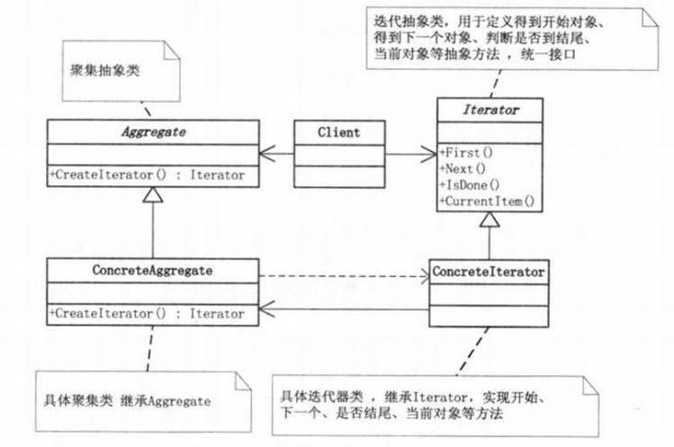

迭代器模式是一个非常常用的设计模式，STL模板中就使用了迭代器设计模式，各种容器的“iterator”就是使用了迭代器模式。我们看一下《设计模式》如何描述这个这个设计模式：

> 提供一种方法顺序访问一个聚合对象中各个元素 , 而又不需暴露该对象的内部表示。

<!--more-->

#### 1.模式适用性

  * 访问一个聚合对象的内容而无需暴露它的内部表示。
  * 支持对聚合对象的多种遍历。
  * 为遍历不同的聚合结构提供一个统一的接口 ， 支持多态迭代。

#### 2.模式结构

**(1)Aggregate**:几个聚集对象，类似STL中的“Vector”、“List”等对象。STL中的Iterator与我们这里描述的枚举器模式有些不一样。其begin()等函数返回一个枚举器，而使用没举器的方法基本是一致的。

**(2)Iterator:**迭代的抽象类，提供提供的聚集的访问接口。像STL中的聚集对象的迭代器，都有&#8221;begin&#8221;、“end”等方法，我们对不同的聚集都可以使用相同的迭代器方法。

**(3)ConcreteAggregate:**具体的聚集，继承自Aggregate。

**(4)Iteratot:**具体的迭代器，我们可以实现不同的迭代器以期可以使用不同的访问方式访问聚集。例如 顺序访问，或者逆序访问等。

#### 3.实现

设计模式是程序开发总结下来的一套经验，我们不必一成不变的遵守某个设计模式的结构。没有最好的设计模式，只有最适合的设计模式，所以应该写出适合我们使用的代码结构。STL中的Iterator也是一个很不错的Iterator结构。我们还是使用第2结中的模式结构来实现Iterator模式。

<pre class="brush: cpp; title: ; notranslate" title="">#include <iostream>
#include <vector>
using namespace std;

template<class Item>
class Iterator
{
public:
	virtual void first() = 0;
	virtual void next() = 0;
	virtual Item* currentItem() = 0;
	virtual bool isDone() = 0;
	virtual ~Iterator() {}
};

template<class Item>
class ConcreteAggregate;

template<class Item>
class ConcreteIterator : public Iterator <Item>
{
	ConcreteAggregate<Item> * aggr;
	int cur;
public:
	ConcreteIterator(ConcreteAggregate<Item>*a) : aggr(a),cur(0){}
	virtual void first()
	{
		cur=0;
	}
	virtual void next()
	{
		if(cur<aggr->getLen())
			cur++;
	}
	virtual Item* currentItem()
	{
		if(cur<aggr->getLen())
			return &(*aggr)[cur];
		else
			return NULL;
	}
	virtual bool isDone()
	{
		return (cur>=aggr->getLen());
	}
};

template<class Item>
class Aggregate
{
public:
	virtual Iterator<Item>* createIterator() = 0;
	virtual ~Aggregate(){}
};

template<class Item>
class ConcreteAggregate:public Aggregate<Item>
{
	vector<Item >data;
public:
	ConcreteAggregate()
	{
		data.push_back(1);
		data.push_back(2);
		data.push_back(3);
	}
	virtual Iterator<Item>* createIterator()
	{
		return new ConcreteIterator<Item>(this);
	}
	Item& operator
	{
		return data[index];
	}
	int getLen()
	{
		return data.size();
	}
};

int main()
{
	Aggregate<int> * aggr =new ConcreteAggregate<int>();
	Iterator<int> *it=aggr->createIterator();

	for(it->first();!it->isDone();it->next())
	{
		cout<<*(it->currentItem())<<endl;
	}
	delete it;
	delete aggr;
	return 0;
}

</pre>

#### 4.总结

迭代器模式在我们的编码中广泛使用，在现在的软件开发中，基本上不需要自己设计迭代器模式结构，不论是STL还是java或者.NET都已经为我们实现了相关的迭代器模式。通过学习迭代器模式，我们可以看出一个设计模式的多种结构，都可以实现相同的目的，所以在我们自己做软件开发的时候，不是生搬硬套一个设计模式使用，我们应为了应用而设计，不是为了设计而应用。就像张三丰交教张无忌太极拳，教完了问“你学会了多少？”张无忌回答“我已经忘得差不多了”。设计模式学的是程序设计的思想方法，而不是代码结构。