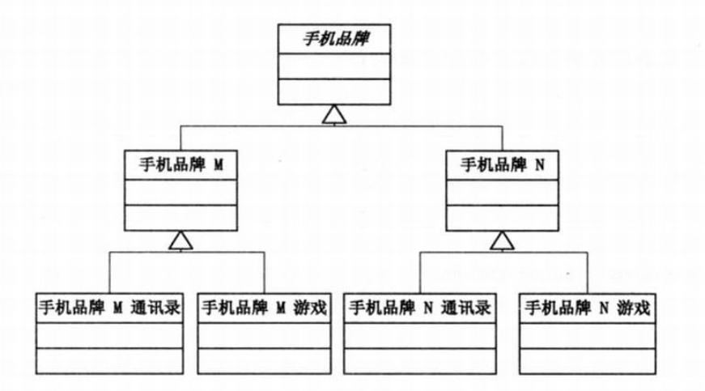
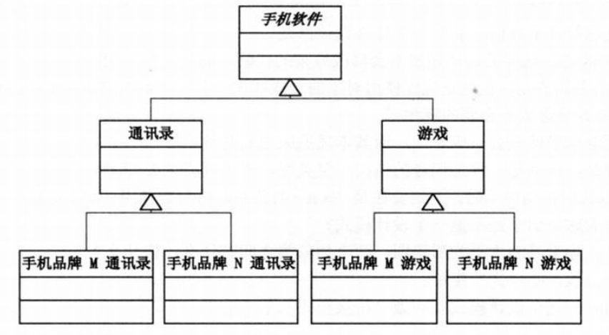
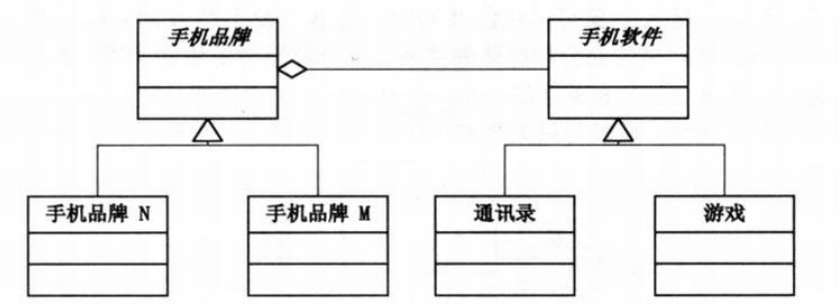
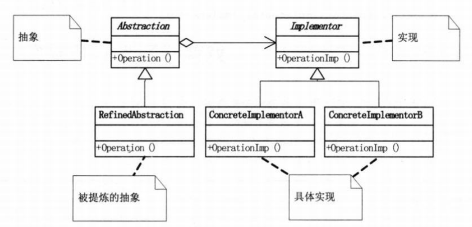

在软件系统中，某些类型由于自身的逻辑，它具有两个或多个维度的变化，多维度的变化使得继承关系无法很好的处理系统扩展的问题，这一回说道的桥接模式可以使用在多维度的系统上。

> 将抽象部分与实现部分分离，使它们都可以独立的变化。

<!--more-->

#### 1.模式适用性

  * 不希望在抽象和它的实现部分之间有一个固定的绑定关系。例如这种情况可能是因为,在程序运行时刻实现部分应可以被选择或者切换。
  * 如果一个系统需要在构件的抽象化角色和具体化角色之间增加更多的灵活性，避免在两个层次之间建立静态的联系。
  * 设计要求实现化角色的任何改变不应当影响客户端，或者说实现化角色的改变对客户端是完全透明的。

#### 2.模式结构与多维问题

手机有不同品牌，手机还有不同软件，这就是一个&#8221;手机&#8221;这个抽象类的多维度变化。不论我们如何按照品牌分类或者软件分类使用继承关系组织这个结构，都在扩展上会遇到麻烦。

按品牌分类实现结构图

&nbsp;

按软件分类实现结构图

上面两种结构中，不论是添加软件还是添加品牌，都会导致系统迅速膨胀，需要新建很多子类。而使用桥接模式则把软件和品牌的实现独立出来，使用聚合的方式关联，所以每个类仍然保持着单一职责，而又不影响扩展性。

桥接模式实现结构图

这样不论是添加品牌或者软件，都不会对另外一方有影响。

桥接模式结构图

#### 3.实现

<pre class="brush: cpp; title: ; notranslate" title="">#include &lt;iostream&gt;
using namespace std;

class Implementor
{
public:
	virtual void Operation() = 0;
};

class ConcreteImplementorA : public Implementor
{
public:
	void Operation()
	{
		cout &lt;&lt; "ConcreteImplementor A execute" &lt;&lt; endl;
	}
};

class ConcreteImplementorB : public Implementor
{
public:
	void Operation()
	{
		cout &lt;&lt; "ConcreteImplementor B execute" &lt;&lt; endl;
	}
};

class Abstraction
{
protected:
	Implementor *implementor;
public:
	void SetImplementor(Implementor *implementor)
	{
		this-&gt;implementor = implementor;
	}

	virtual void Operation()
	{
		implementor-&gt;Operation();
	}
};

class RefinedAbstraction : public Abstraction
{
public:
	void Operation()
	{
		implementor-&gt;Operation();
	}
};

int main()
{
	Abstraction *ab = new RefinedAbstraction();
	Implementor *ciA = new ConcreteImplementorA();
	Implementor *ciB = new ConcreteImplementorB();

	ab-&gt;SetImplementor(ciA);
	ab-&gt;Operation();

	ab-&gt;SetImplementor(ciB);
	ab-&gt;Operation();

	delete ab;
	delete ciA;
	delete ciB;

	return 0;
}
</pre>

#### 4.总结

桥接模式则把原来的基类的实现化细节抽象出来，将实现予以解耦。抽象和实现可以独立扩展，不会影响到对方。