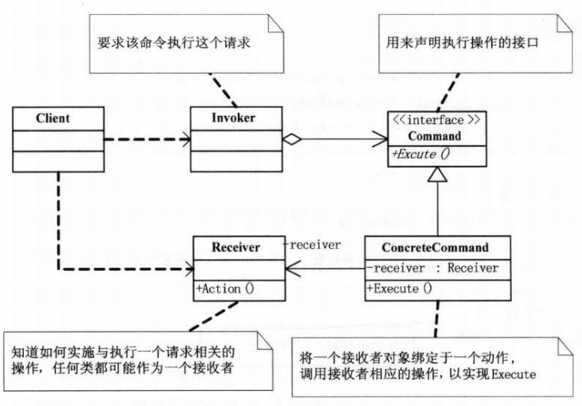

在软件系统中，“**行为请求者**”与“**行为实现者**”通常呈现一种“**紧耦合**”，但在某些实际应用场景下我们需要对请求进行记录、撤销等操作，这是这种紧耦合的结构不能满足需求的变化，此时我们可以使用命令(Command)模式来应用在这种场景。

> 将一个请求封装为一个对象,从而使你可用不同的请求对客户进行参数化;对请求排队或记录请求日志,以及支持可撤消的操作。

## 1.模式适用性
  * 系统需要将请求调用者和请求接收者解耦，使得调用者和接收者不直接交互。
  * 系统需要在不同的时间指定请求、将请求排队和执行请求。
  * 系统需要支持命令的撤销(Undo)操作和恢复(Redo)操作。
  * 系统需要将一组操作组合在一起，即支持宏命令。

## 2.模式结构


**(1)Command:** 执行命令的接口。

**(2)ConcreteCommand:** 实现Command的具体类，将一个接收者(Receiver)对象绑定于一个动作，调用接收者相应的操作，以实现Execute。

**(3)Invoker:** 命令的管理者，具体的撤销，重做，记录等功能都在这里实现。

**(4)Receiver:** 知道如何实施与执行一个相关的操作，即操作最终的实现者。

## 3.实现
```c++
#include <iostream>

class Receiver
{
public:
        void Action()
        {
                std::cout << "Action..." << std::endl;
        }
};

class Command
{
protected:
	Receiver *receiver;
public:
	Command(Receiver *r)
	{
		this->receiver = r;
	}
	virtual ~Command(){}
	virtual void Execute() = 0;
};

class ConcreteCommand : public Command
{
public:
	ConcreteCommand(Receiver *r) : Command(r) {}
	~ConcreteCommand() {}
	void Execute() 
	{
		receiver->Action();
	}
};

class Invoker
{
private:
	Command *command;
public:
	void SetCommand(Command *c)
	{
		this->command = c;
	}

	void ExecuteCommand()
	{
		command->Execute();
	}
};


int main()
{
	Receiver *r = new Receiver();
	Command *c = new ConcreteCommand(r);
	Invoker *i = new Invoker();

	i->SetCommand(c);
	i->ExecuteCommand();

	delete r;
	delete c;
	delete i;
}
```
## 4.总结

命令模式可以比较容易的实现一个命令队列，并且对这个命令队列进行管理，支持撤销和重做等功能。而且对于“行为请求者”和“行为实现着”进行了很好的分离。使用整个模式修改点在ConcreteCommand和Invoker，所以我们可以不比修改客户端代码而进行扩展和功能修改。