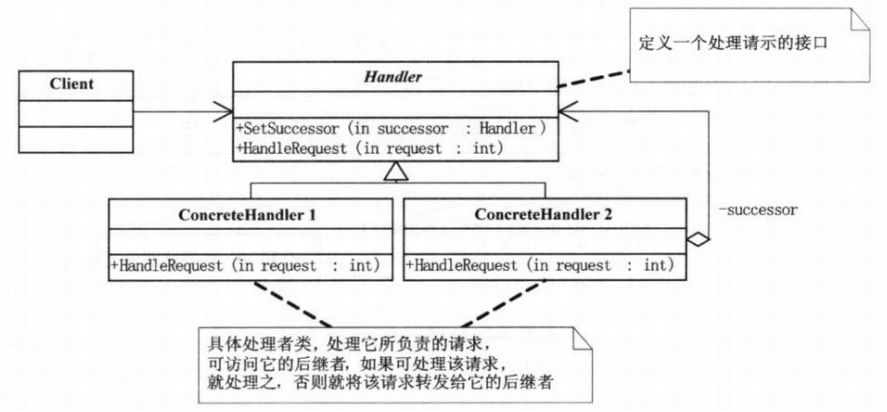

- [1.模式适用性](#1模式适用性)
- [2.模式结构](#2模式结构)
- [3.实现](#3实现)
- [4.总结](#4总结)

职责链模式将请求响应者串成一条链，一般的请求响应者保存一个下家响应者，当无法处理请求的时候将此请求交给下家响应者，直到请求得以被处理。

> 职责链模式使多个对象都有机会处理请求,从而避免请求的发送者和接收者之间的耦合关系。将这些对象连成一条链,并沿着这条链传递该请求,直到有一个对象处理它为止。

<!--more-->

## 1.模式适用性

  * 有多个的对象可以处理一个请求,哪个对象处理该请求运行时刻自动确定。
  * 在不明确指定接收者的情况下,向多个对象中的一个提交一个请求。
  * 可处理一个请求的对象集合应被动态指定。

## 2.模式结构



**(1)Handle:**定义请求的接口

**(2)ConcreteHandle:**具体的处理响应者，可以处理一定范围的请求，当请求不再自己的处理范围内，将请求转发给下家响应者

## 3.实现

```c++
#include <iostream>
#include <vector>
using namespace std;

class Handle
{
protected:
	Handle *successor;
public:
	void SetSuccessor(Handle *handle){ this->successor = handle;}
	virtual void HandleRequest(int request) = 0;
	virtual ~Handle(){}
};

class ConcreteHandle1 : public Handle
{
public:
	void HandleRequest(int request)
	{
		if(request < 100)
			cout << "ConcreteHandle1: Request " << request << " accept." << endl;
		else
			if(successor != NULL)
				successor->HandleRequest(request);
	}
};

class ConcreteHandle2 : public Handle
{
public:
	void HandleRequest(int request)
	{
		if(request <= 500)
			cout << "ConcreteHandle2: Request " << request << " accept." << endl;
		else
			cout << "ConcreteHandle2: Request " << request << " refuse." << endl;
	}
};

int main(int argc, char *argv[])
{
	Handle *h1 = new ConcreteHandle1();
	Handle *h2 = new ConcreteHandle2();

	h1->SetSuccessor(h2);
	vector<int> requests = {10, 20, 500, 1000, 200, 5000};

	for(auto it = begin(requests); it != end(requests); ++it)
		h1->HandleRequest(*it);

	delete h1;
	delete h2;
	return 0;
}
```

## 4.总结

职责链模式可以避免请求发送者与接收者耦合在一起，让多个对象都有可能接收请求，将这些对象连接成一条链，并且沿着这条链传递请求，直到有对象处理它为止。发出这个请求的客户端并不知道链上的哪一个对象最终处理这个请求，这使得系统可以在不影响客户端的情况下动态地重新组织链和分配责任。