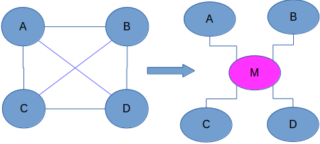
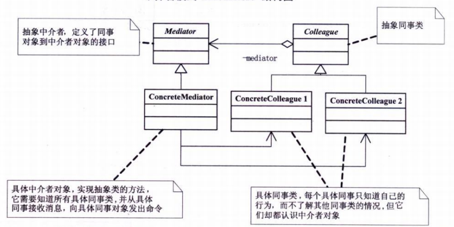

中介者模式用于解决多个对象相互通讯的问题，当多个对象需要相互通讯时需要了解彼此的接口，使得对象之间成为紧耦合的关系，使用中介者模式将对象间通讯分离开来，通讯将通过中介者，起到通讯对象的解偶作用。

> 用一个中介对象来封装一系列的对象交互。中介者使各对象不需要显式地相互引用,从而使其耦合松散,而且可以独立地改变它们之间的交互。

<!--more-->

#### 1.模式适用性

  * 一组对象以定义良好但是复杂的方式进行通信。
  * 一个对象引用其他很多对象并且直接与这些对象通信 ,导致难以复用该对象。
  * 想定制一个分布在多个类中的行为,而又不想生成太多的子类。

#### 2.模式结构

现有ABCD四个对象需要进行通讯，下图展示了使用中介者模式如何减少对象间的耦合关系：

中介者模式结构图如下所示：

#### 3.实现

&nbsp;

<pre class="brush: cpp; title: ; notranslate" title="">#include <iostream>
#include <string>
using namespace std;

class Colleague;

class Mediator
{
public:
	virtual void Send(string message, Colleague *colleague) = 0;
	virtual ~Mediator(){}
};

class Colleague
{
protected:
	Mediator *mediator;
public:
	Colleague(Mediator *mediator)
	{
		this->mediator = mediator;
	}
	virtual ~Colleague(){}
};

class ConcreteColleague1 : public Colleague
{
public:
	ConcreteColleague1(Mediator *mediator) : Colleague(mediator){}

	void Send(string message)
	{
		mediator->Send(message, this);
	}

	void Notify(string message)
	{
		cout << "ConcreteColleague1 get message:" << message << endl;
	}
};

class ConcreteColleague2 : public Colleague
{
public:
        ConcreteColleague2(Mediator *mediator) : Colleague(mediator){}
        
        void Send(string message)
        {
                mediator->Send(message, this);
        }

        void Notify(string message)
        {
                cout << "ConcreteColleague2 get message:" << message << endl;
        }
};

class ConcreteMediator : public Mediator
{
private:
	ConcreteColleague1 *colleague1;
	ConcreteColleague2 *colleague2;
public:
	void SetColleague1(ConcreteColleague1 *p)
	{
		this->colleague1 = p;
	}

	void SetColleague2(ConcreteColleague2 *p)
	{
		this->colleague2 = p;
	}

	void Send(string message, Colleague *colleague)
	{
		if(colleague == colleague1)
			colleague2->Notify(message);
		else
			colleague1->Notify(message);
	}
};

int main(int argc, char *argv[])
{
	ConcreteMediator *m = new ConcreteMediator();

	ConcreteColleague1 *c1 = new ConcreteColleague1(m);
	ConcreteColleague2 *c2 = new ConcreteColleague2(m);

	m->SetColleague1(c1);
	m->SetColleague2(c2);

	c1->Send("DABAOjIAN tonight?");
	c2->Send("fantastic!");

	delete m;
	delete c1;
	delete c2;
	return 0;
}
</pre>

#### 4.总结

中介者的有点是“降低了系统对象之间的耦合性，使得对象易于独立的被复用；提高系统的灵活性，使得系统易于扩展和维护” 但同时 “**中介对象承担了较多的责任，所以一旦这个中介对象出现了问题，那么整个系统就会受到重大的影响**”。