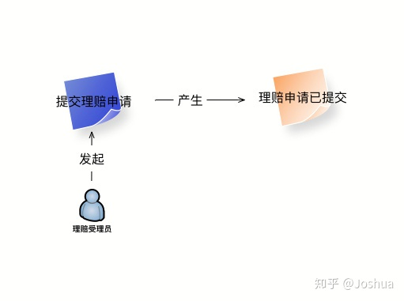
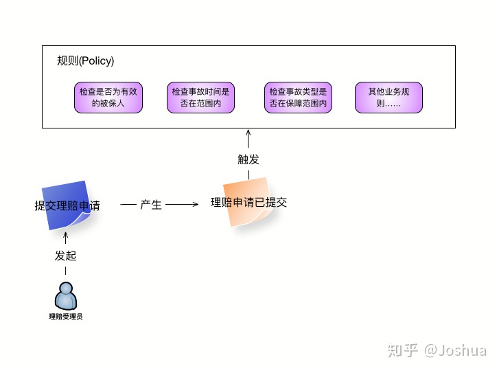
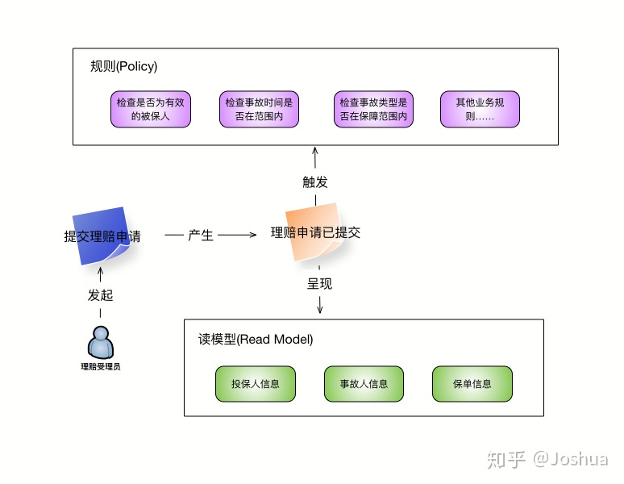
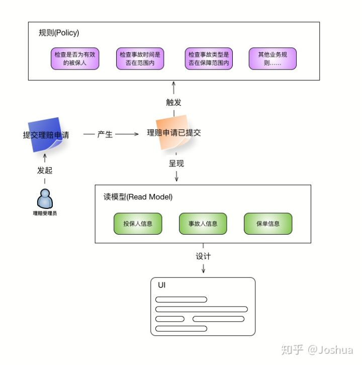
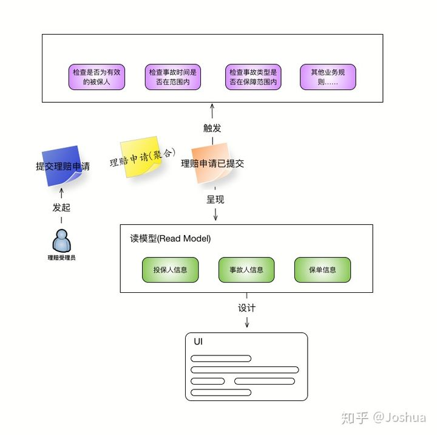
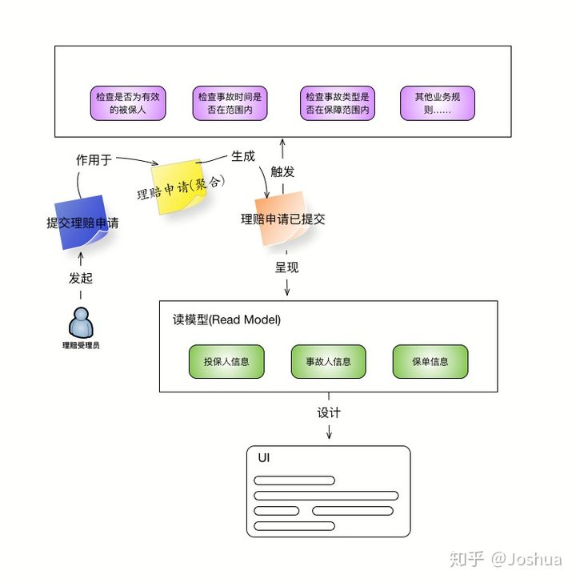
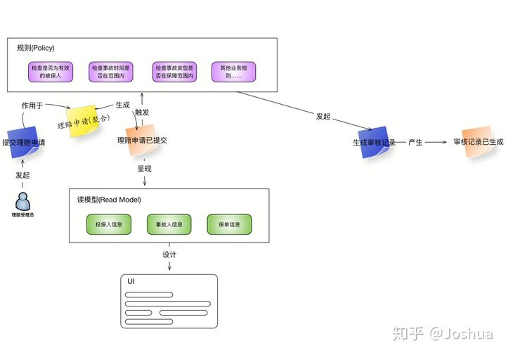

::上一篇:: 文章中介绍了什么是事件风暴，以及相关的概念。那么这次会通过一个实际的例子带领大家经历一次完整的事件风暴，并且分享自己在使用事件风暴中所遇到的问题。那么就让我们开始吧。

**背景**
------

在正式开始事件风暴之前，先来介绍一下业务分析的场景。我从之前参与保险核心业务系统中选择了一个业务场景，用来展现如何使用事件风暴发现领域中的聚合与其他相关领域对象。

这里选择的业务场景是保险事故的理赔流程，由于篇幅的问题，我省略了一些过于琐碎的业务细节，保留了主干流程与核心的业务规则，以下是对业务流程的介绍。

### **理赔受理**

理赔受理主要涉及由保单投保人向保险公司提出理赔申请，并由理赔受理人员按照提交的事故信息在系统中进行录入，并进行必要的业务规则校验，例如当前投保人是否持有有效的保单，事故类型是否在保单保障的范围之内等。

如果这些业务校验都通过，那么就会生成一条崭新的理赔申请。

### **理赔审核**

审核部分的工作则主要分为两个部分，其一是对受理阶段录入的事故与保单信息进行复核，检查是否存在错误或是欺诈。其二是在保险产品基础理赔金额的基础上进行手动的修改。

如果在审核过程中发现任何问题，可以将该次理赔申请退回至受理的阶段，重新填写相关信息。而如果当前理赔信息正确无误，则进入下一个业务环节。

### **理赔给付**

这部分的工作主要是对理赔的最终金额和其他相关信息进行确认，如果确认无误则会产生需要支付费用的财务信息，否则该理赔申请会退回审核的环节。

以上就是经过缩减的保险理赔流程，接着看看事件风暴是如何帮助我们对业务流程以及领域对象进行分析的。

**事件风暴**
--------

### **受理事件**

经过业务人员的叙述后，我们得到了如下的「命令」与「事件」。

从图中我们可以看到「理赔受理员」作为用户发起了「提交理赔申请」命令，而该命令生成了「理赔事件已提交」的事件。

紧接着我们与业务人员继续深入讨论，了解到在提交理赔申请时需要进行相关的业务规则校验，如下所示:

    * 理赔申请中填写的事故人是系统中已有且有效的被保人
    * 事故发生的时间在保单生效的时间范围之内
    * 事故的类型是保单保障范围内的
    * 如果理赔受理申请成功，则进入理赔审核环节

为了叙述简单，省略其他相对繁琐的业务规则，只保留了以上这些作为示例。按照上面由业务人员讲述的业务规则之后，我们可以在事件风暴上增加「规则」的部分，如下图所示:

然后业务人员会向我们描述在理赔受理过程中需要提交的各种数据项，例如投保人，事故人的详细信息，包括姓名，年龄，证件号码等。以及相关事故的信息，包括事故类型，发生时间等。同时我们还了解到，在进行理赔受理的时候需要给受理人员实时展示符合条件的保单列表，供受理人员进行选择。

按照以上这些信息，我们可以提炼出多个「读模型」，用来展示用户所需的数据，此时的事件风暴如下图所示:

而在「读模型」的基础上，可以设计用户界面的草图，让整个团队在 UI 层面达成一致。修改后的事件风暴如下所示:

现在我们已经使用事件风暴的方式对理赔受理做了一个初步的建模，现在可以试着分析理赔受理环节所牵涉到的聚合与领域对象。从「命令」与「事件」的名称中我们其实很容易就看到「聚合」的线索，即名为「理赔申请」的聚合对象。接着就要分析这个聚合对象有哪些领域对象组成。

「规则」与「读模型」为我们展示了更多「理赔申请」的所需信息，包括「投保人」，「被保人」，「事故」，「保单」这些领域实体，也有「事故类型」，「保障范围」这些值对象。通过对这些信息的梳理，可以得到一个聚合的草图，如下图所示:

我们可以把它贴在「命令」与「事件」的中间，并做一些修改如下图所示:

### **审核事件**

从受理的业务规则中我们得知，如果理赔受理成功，那么该次的理赔申请就会进行后续的审核与理算。因此接着是由理赔审核人员审核该次理赔申请，并理算相关的赔付金额。审核的业务流程是由受理对应的业务规则所产生，因此从图上可以看到，该「命令」的发起者不再是「用户」，而是「规则」，如下图所示:

参照之前受理的分析过程，我们可以将与事件相关的规则，读模型，等元素逐一增加上去。最终完成理赔审核流程的分析。

### **其他需要注意的问题**

在实际的分析过程中，有些场景中「命令」并不是通过作用在「聚合」上之后再生成「事件」的，而是作用在一个「外部系统」上，在事件风暴中可以通过一个粉色的便签表示「外部系统」。

还有就是如果在事件风暴进行过程中发现任何问题，不应该陷入长时间的讨论，可以设定一个简单的 time box，例如 5 分钟。如果在时间范围内没有达成共识，可以用一张红色的便签标注这个问题，留待之后进行专项的讨论。

最后一点是可以通过事件风暴来划分系统内的限界上下文，主要的方法是寻找连接不同业务模块的关键事件。

**对于事件风暴的一些思考**
---------------

在使用了几次事件风暴之后，我也对这种方法论有了一些相对深入的思考。我们先不妨看一下，事件风暴完成后的交付是什么？最显著的成果当然是来自于领域模型的「聚合」。但是依照我的经验，这里的聚合更多的是**「概念层面的模型」**，并不适合直接拿来做数据模型甚至是代码层面的设计。由于进行事件风暴的事件长度一般为 2～3 小时，因此不可能牵涉到太多的业务细节，所以这里得到的聚合模型更多的价值在于帮助开发人员挖掘领域实体的概念，澄清各个领域实体之间的关系。对于业务人员而言，事件风暴的价值在于将开发系统所需的领域知识通过一种简单，清晰，且整个团队都理解的方式呈现出来。所以事件风暴另一项我觉得非常有价值的作用就是**「统一语言」**，帮助整个团队对于领域知识，领域对象以及之间的关系达成一致。

那么有了事件风暴梳理的业务流程，是否还需要需求文档呢？我的答案是需要，而且应该在事件风暴开始之前就准备好，至少是个初版。在事件风暴的过程中需要讨论大量的业务规则，但是不可能在有限的时间内，在现场将这些规则一一罗列，特别是牵涉到大量的业务数据项。因此在开始之前，业务部门应该首先梳理一个大致的业务流程与相关的业务规则，避免在现场再开始回忆，从而消耗时间，并且可能遗漏重要的业务规则。

不必纠结于在事件风暴的现场需要列出所有的业务规则与流程，这是不现实也是不可能的。就如我之前提到的，事件风暴带给团队更多的是对于领域知识认知的一致性，以及对于概念模型的认知。在此基础上需要更进一步的分析与设计工作才能落实到具体的代码，注意不遗漏关键的主线流程和核心的业务规则即可，可以在事件风暴结束前做一个总体性的回顾，看看有没有疏漏之处即可。

最有一点就是**「没有银弹」**，不应该寄希望于某种方法论一锤定音，能够得到完美的系统架构和领域模型。提升团队整体对于领域知识的理解与共识，提高自身的设计能力，避免系统的强耦合，快速短小的迭代才是实践领域驱动设计的不二法门。

_**欢迎关注我的微信号「且把金针度与人」,获取更多高质量文章**_

> @Joshua https://zhuanlan.zhihu.com/p/113619126