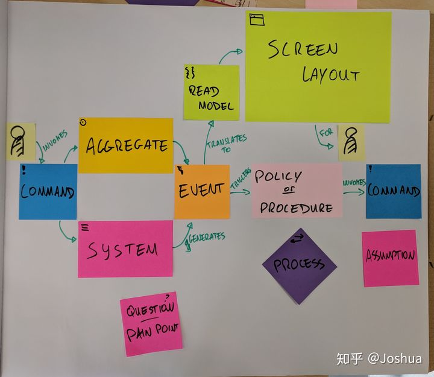
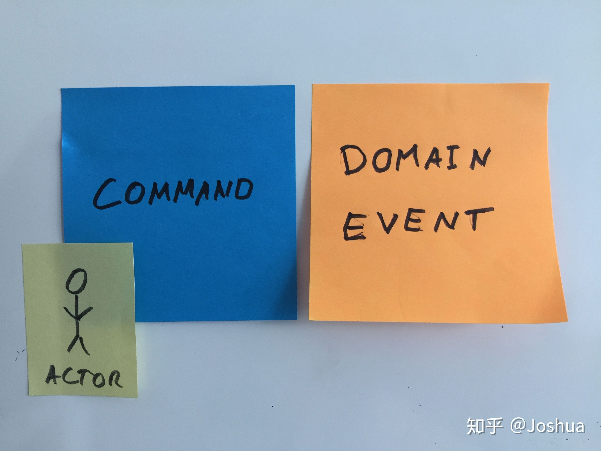
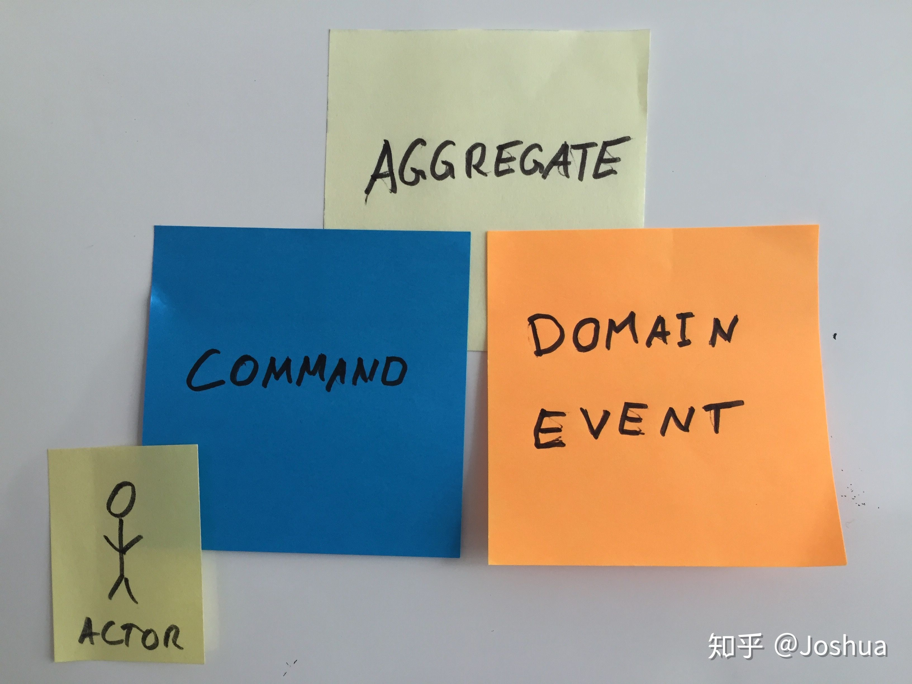
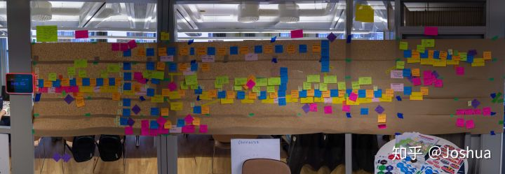

## DDD 实践手册(番外篇: 事件风暴-概念)
在我过往的项目经历中，DDD 落地遇到最大的问题会有两个，其一是如何发现系统中的 Aggregate(聚合)，其二是如何划分 Bounded Context(限界上下文)。这两个元素可谓是 DDD 的核心概念，分别对应了单个业务功能模块内核心的领域对象，以及如何划分业务功能的边界。

这两项工作的共同点，或者说是困难之处都来源于不是一项单纯的技术工作，而是掺杂了许多对于 Domain Knowledge 的理解。我自己并没有什么成型的方法论或是特定的模式来解决这一问题，可能唯一的建议就是多思考，多写代码，事后做好分析。同时作为开发者并不要排斥业务知识，而是应该多向业务部门的同事学习，了解他们对于系统的认知，以及行业的发展，这样才能真正的对系统设计有深入的思考。

然而最近的几个项目中，情况有了一些变化。在基于 DDD 进行系统分析方面有了一个新兴的方法论，即 Event Storming(事件风暴)，它是一种轻量级的系统分析方法，基于 DDD 的概念，能够为我们梳理系统中的各种相关元素，其中包括了核心的 Aggregate。这次的番外篇会介绍事件风暴的概念与使用方法，以及项目中遇到的问题与反思。

## 事件风暴
### 什么是事件风暴
事件风暴是由 Alberto Brandolini 发明的一种轻量级，基于 DDD 概念的系统分析方法，详细的解释可以参考它的官方网站: [Event Storming](https://www.eventstorming.com/)。

在我有限的使用经验中，事件风暴最大的作用是帮助开发人员，业务人员，UX，测试等项目参与者对于业务流程有一个统一的认识，这包括关键的流程，核心的业务规则，系统不同模块的使用者。其次是帮助开发人员梳理核心的业务对象，从某种程度上来说就是就是领域对象中的聚合。

事件风暴都是以 Workshop 的形式展开，因此在开始之前需要做好各项的准备工作，下面介绍所需的前期准备。

### 准备工作
在开始事件风暴之前，需要邀请相关的参与人员，已经准备相关的物料，具体如下:

* **参加人员**: 条件许可的情况下应该全员参与，包括系统开发人员，业务分析师，业务人员，测试工程师，UX 设计师，项目管理人员等。
* **场地要求**: 场地尽可能的大，关键是要有一面长 4 米左右的墙壁，用来悬挂或是黏贴纸张。
* **其他物料**: 在进行事件风暴的过程中还需要准备以下的材料:
   * 马克笔，准备 3 种不同颜色的多只马克笔。
   * 数张大型的招贴纸，如果一时找不到很大的可以用几张小型的纸拼凑一下，具体效果参考下图:

各种不同颜色的即时贴，包括**蓝色，黄色，红色，橙色，绿色，粉色，紫色**，不同颜色的即时贴对于事件风暴有不同的意义，因此请务必准备好这些颜色的即时贴。

### 核心概念
事件风暴将系统拆分为不同的元素，用不同颜色的即时贴表示，请参考下图对于不同颜色即时贴的解释:

* **事件(Event)**: 事件风暴中的核心概念，它代表了某一个**「业务行为」，描述的形似为宾语+动词的过去式**。例如: 「订单被提交」，「账户被锁定」，「商品已被发出」。使用橙色的即时贴表示。
* **命令(Command)**: 既然有了事件必然有产生事件的对象，这就是命令。命令可以理解为是一个动作，执行了动作之后就会产生相应的事件。典型的动作描述可以是: 「取消订单」，「结账」等。使用深蓝色的即时贴表示。
* **用户(User 或 Actor)**: 同样的命令也是由对象执行的，这称之为用户。这里的用户一般是指自然人，例如一个电子购物网站的顾客。

这里我们先做一个小小的总结，把上面的概念融合一下。

事件风暴的核心流程就是由**用户**执行了**命令**，从而产生了**事件**。基于这个事件的结果(后续会谈及)，与之前相同或是其他的用户会执行另一个命令，产生新类型的事件，以此类推。而顺序是按照业务逻辑而定的。简单的可以参考下面一个简单的示例:

我们继续解释其他的概念。

* **规则(Policy)**: 当产生事件时，需要进行某些业务相关的规则校验，例如订单提交后需要检查库存是否充足，客户的支付交易是否成功等，诸如此类的业务规则可以使用粉色的即时贴表示。
* **读模型(Read Model) 与页面布局(Screen Layout)**: 事件产生后的另一个结果往往是呈现在用户面前的系统界面，在这里我们使用页面布局进行展示。这部分的工作一般由 UX 与业务人员完成，展现他们所需要的用户界面。同时页面布局上会展现用户所关心的数据，例如，当用户执行「结账」的命令之后，生成了「购物车结算」事件，此时呈现在用户面前的应该是商品明细信息和总金额。这样的数据我们使用读模型表示。
* **外部系统(System)**: 事件并不一定由命令产生，也可能由一个外部系统产生，例如一个第三方的支付系统会调用由你系统提供的回调接口，确认客户支付成功，由此产生一个「费用已支付」的事件。
* **问题(Question) 与假设(Assumption)**: 在讨论过程中各个参与人员可能会发生分歧，例如对于事件的定义，或是由哪个用户执行，或者是具体的规则是什么。此时如果无法在规定的 time box 之内达成统一意见(一般为 5 分钟)，可以将问题写在红色的即时贴上，作为问题，或是对某种情况的假设记录下来。
* **聚合(Aggregate)**: 当一个完整的业务流程通过上述方式写完之后，对于每个用户，命令，事件进行组合，我们就能获得聚合了，用事件风暴的描述就是「用户在 XX 聚合对象上执行了 YY 命令，生成了 ZZ 事件」。例如「顾客在购物车对象上执行了结账命令，生成了购物车结算事件」。即时贴的效果如下图:

最终效果如下图所示，你将获得完整的业务流程分析:

## 小结
由于篇幅所限，这次只是简单介绍了事件风暴的概念，和简单的使用介绍。下一篇中我会通过一个具体的业务场景描述如何使用事件风暴进行完整的业务分析，并识别出领域中的聚合对象等核心元素。

> @Joshua https://zhuanlan.zhihu.com/p/110979132